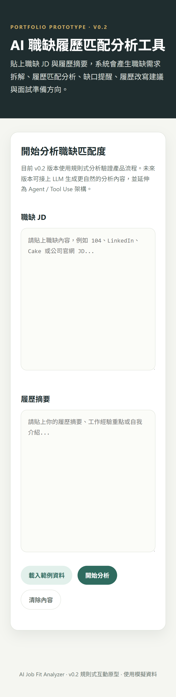
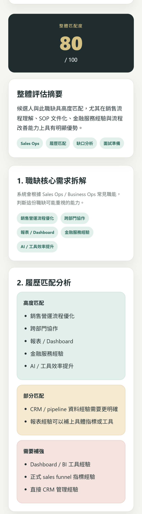
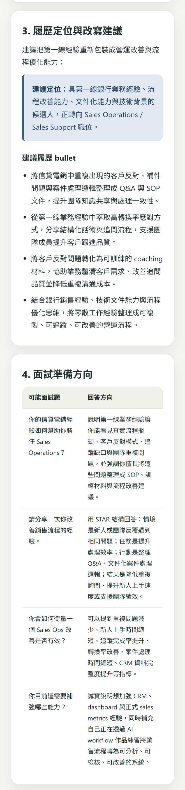

# AI Job Fit Analyzer

> AI-powered job description and resume fit analyzer that helps users identify role requirements, match resume strengths, find skill gaps, and generate interview preparation suggestions.

## Live Demo
- Interactive Demo: https://ai-rita.github.io/ai-job-fit-analyzer/

## Screenshots
### Input Page


### Fit Analysis


### Interview Preparation


## Documentation

- [Product Spec](docs/product-spec.md)
- [Sample Job Description](sample-data/sample-jd.md)
- [Sample Resume Summary](sample-data/sample-resume-summary.md)
- [Sample Analysis Report](sample-output/job-fit-analysis-report.md)

## Project Overview

AI Job Fit Analyzer is a portfolio prototype designed for career transition planning.  
Users can paste a job description and a resume summary, and the system analyzes the job requirements, compares them with the user's experience, and generates actionable suggestions for resume improvement and interview preparation.

This project focuses on turning an ambiguous job description into a structured decision-support workflow.

> **Current version:** Rule-based interactive prototype used to validate the job-fit analysis workflow.  
> **Future direction:** LLM-generated JD analysis, resume matching, interview coaching, and Agent / Tool Use architecture.

## Problem

When applying for Sales Operations, Sales Support, RevOps, or Business Analyst roles, job seekers often struggle to answer:

- What does this job actually prioritize?
- Which parts of my experience match the role?
- Which requirements are only partially covered?
- What gaps should I prepare for?
- How should I adjust my resume and interview stories?

## MVP Goal

The first MVP will support one simple workflow:

```text
Paste Job Description
↓
Paste Resume Summary
↓
Analyze Job Requirements
↓
Compare Resume Fit
↓
Generate Resume and Interview Suggestions
---
## Disclaimer

This project is a portfolio prototype built with simulated job descriptions and resume summaries.  
It does not contain private personal data, confidential company information, or proprietary hiring criteria.

本專案為履歷作品原型，所有職缺與履歷內容皆為模擬資料，不包含個人隱私資料、公司機密資訊或專有招募標準。
